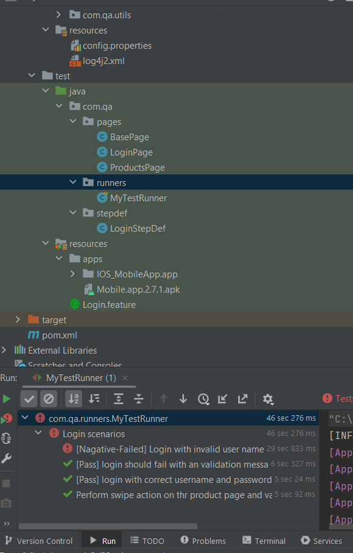

Prerequisites

Before running the automated tests, ensure that you have the following software installed:

	• Android Studio
	• Appium
	• Nodejs
	• Java
	• Appium server
	• Maven
	• Appium inspector
	• IntelliJ IDE

Installation
	• Setup Java , Android studio & NodeJS path in environmental variable.
	• Setup emulator Device on Android studio
	• Install mobile application in the emulator. .apk file are present on path: 'src/test/resources/apps'.
	• Clone this repository to your local machine:
		○ git clone https://github.com/Tecniti/MobileTest_Automation.git
	• Load all the dependencies from POM file by clicking on maven dependency load.

Running Framework
	• Open Android studio and start the emulator.
	• Open the project on IntelliJ
	• Right click on the testrunner file, which is present on path: 'src/test/java/com/qa/runners/MyTestRunner.java'
	• This will trigger the test execution on the specified emulator

Test Reporting
	After running the tests, a detailed cucumber test report will be generated. This report will include information about test cases, test results, and any failures encountered during the execution.
	The report can be found in the reports directory on target folder at PATH:'target/HSBC_TestReport/report.html'

Testcase
	Added below 4 testcase mentioned as below.

	• Negative scenario, for which testcase status should be Fail.
		a. Login with invalid username and correct password.

	• Positive scenario, for which testcase status should be Fail.
		a. Login should fail with an validation message if username/password is wrong:
		b. Login with correct username and password And Verify the tittle of the next screen after login.
		c. Perform swipe action on the product page and validate the result.

Framework Structure
	- Contains application configuration related functions in the JAVA folder.
	- .apk file of IOS and android are present in the resource folder
	- Contains test cases written in Gherkin syntax in the Loginfeature files. Each testcase in login file is correspond to a method specified in stepdefintion.
	- All the basic utility which requires to handle the method of stepdefinition are present in the pages folder.

